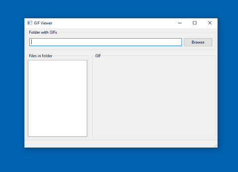
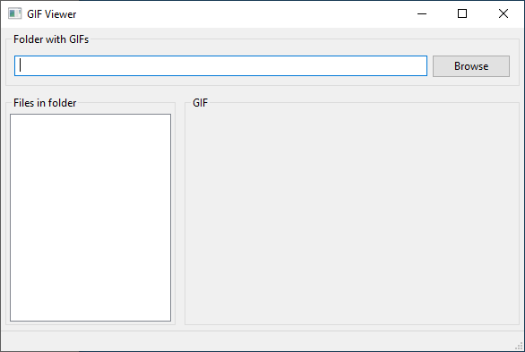
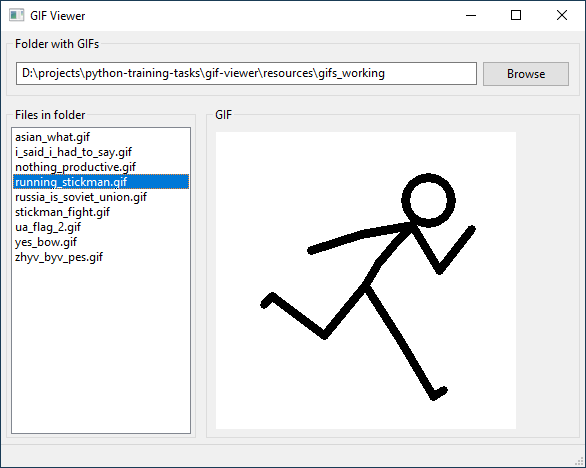

# gif-viewer

### About

* GUI built with wxFormBuilder
* wxPython==4.0.7.post1 requered
* tested on Windows 10 Home
* starting idea from tutorial by PythonBytes [here](https://www.youtube.com/playlist?list=PLBBLzLT9U_rTVrjKF0izr5u7KTIf9PhBJ)

### Screenshots

